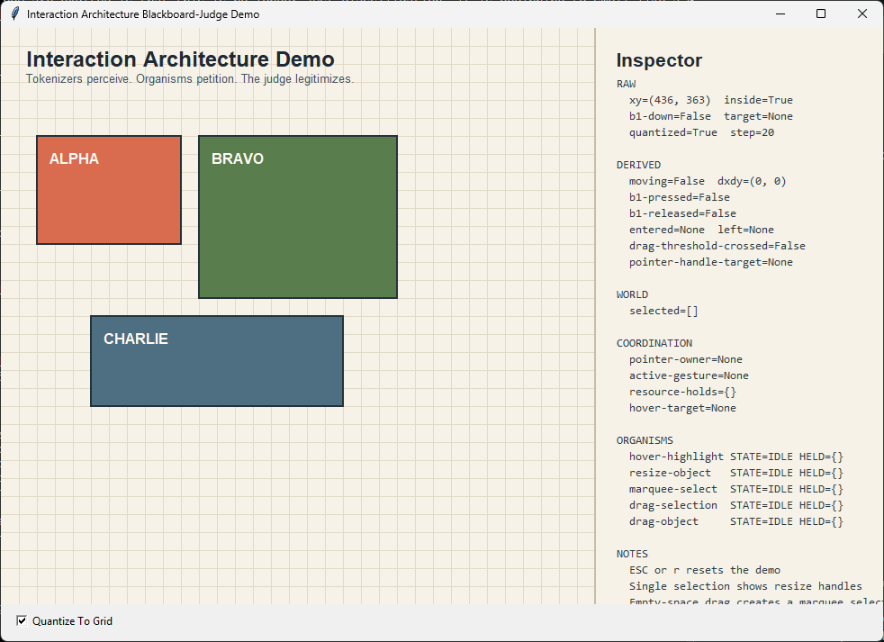

# Blackboard-Judge Architecture Demo

This repository contains a small `tkinter.Canvas` program demonstrating the
interaction architecture described in
`interaction-architecture-blackboard-judge.v1`.

The demo keeps the architecture explicit:

- `RAW` and `RAW-PREV` hold normalized input snapshots
- tokenizers derive shared perceptual structure into `DERIVED`
- organisms recognize temporal interaction episodes
- the judge authoritatively maintains `COORDINATION`
- effects route separately into world mutation and projection preview

## Screenshot



## Run

```powershell
$env:PYTHONPATH = "src"
python -m demo
```

