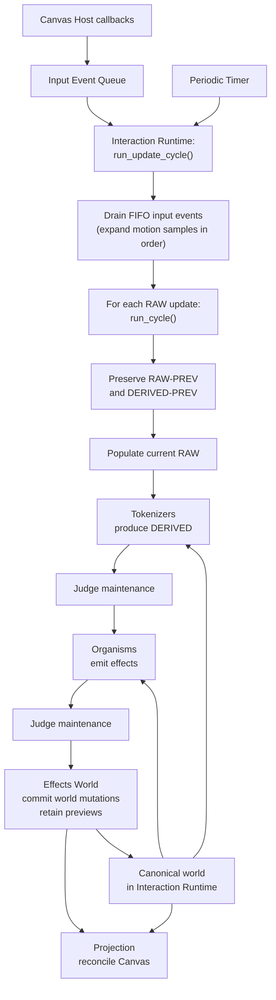

# Module — Interaction Runtime

## Source Evidence

`src/demo/app.py` — state initialization, `run_cycle()`, snapshot handling,
and RAW population.

## Render Target

`src/bad_demo/interaction_runtime.py`

## OWNS

- Construction and reset of the demo's shared runtime, world, and named
  runtime bundles.
- Draining pending normalized input events and applying them in FIFO order.
- Cycle ordering and snapshot replacement.
- RAW population from callback input and current UI setting.
- The authoritative display configuration: Canvas dimensions, playfield bounds,
  and quantization step.
- The authoritative quantization step, and capture of the current
  quantization-enabled and show-grid checkbox values as separate RAW facts.

## Runtime Bundles

Interaction Runtime declares the shared runtime context directly.  It does not
hide these named regions inside a generic `system` mapping.

```python
g = {}

world = {
    "objects": {},
    "selected-objects": [],
}

config = {
    # Canvas dimensions, playfield bounds, interaction thresholds,
    # sizing limits, margins, and quantization step.
}

raw = {}
raw_prev = {}

derived = {}
derived_prev = {}

```

- `raw` and `raw_prev` are the current and prior normalized input snapshots.
- `derived` and `derived_prev` are the current and prior tokenizer fields.
- `world` and `config` are the one canonical durable-world and configuration
  contexts.  Other modules read them directly; Effects World is authorized to
  mutate `world` through routed world effects.

## READS

- Pending normalized input events from Input Event Queue.
- The Show Grid and Quantize To Grid controls through narrow Canvas Host
  Window adapters.
- Monotonic clock interface.

## CALLS

- Tokenizer initialization and pass.
- Judge initialization and maintenance.
- Organism initialization and evaluation.
- Effect routing.
- Projection refresh.
- Input Event Queue drain operation.

## MAY SAFELY ASSUME

- Calls arrive on the Tkinter main thread.
- Called layers follow the contracts in `../aspects/architecture-ownership.md`.

## ENSURES

- RAW-PREV and DERIVED-PREV represent the prior completed cycle.
- Pointer-motion packets are processed sample-by-sample in their recorded
  order, preserving the motion path while allowing queue coalescing.
- Tokenizers run before organisms.
- All organisms run against one stable world state.
- Effects route after organism execution and before projection.
- A caller may invoke the cycle with no changed pointer data so temporal facts
  can advance without new pointer motion.
- Projection receives the authoritative display configuration when it renders;
  it may pass the grid-relevant portion to Grid without becoming the owner of
  those numbers.
- Interaction modules receive the current quantization fact and configuration
  through the normal cycle; see [Quantization](../aspects/quantization.md).

## DOES NOT OWN

- Perceptual field definitions, organism behavior, Judge policy, effect meaning,
  or Canvas commands.

## Sketch

```python
def run_update_cycle():
    if the event queue is empty, add a timestamp "time passes" event to the queue.
    Drain the event queue, applying each event.

def apply_event_to_runtime(event):
    if event.type == "POINTER_MOTION":
        for sample in event.samples:
            run_cycle(sample)
        return

    run_cycle(normalize_event_as_raw_update(event))


def run_cycle(raw_update):
    preserve_previous_snapshots()
    populate_current_raw(raw_update)
    run_tokenizers()
    maintain_judge()
    evaluate_organisms()
    maintain_judge()
    route_effects()
    project_current_state()
```

## Major System Flow



The initial render may use this same cycle as a priming cycle; no separate
startup-only interaction path is required.
